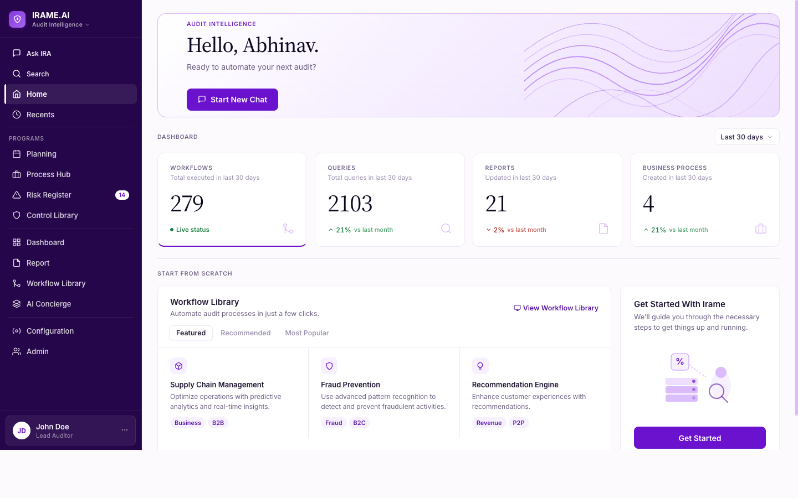

# design-sys — Editorial GRC

The official design system for our GRC (governance, risk, compliance) SaaS
platform, packaged as a [Claude Code Skill](https://docs.claude.com/en/docs/claude-code/skills).
Clone it once, and every developer on your machine generates UI that
matches the system — no memorizing, no drift, no style policing in PR.

## What's in this repo

```
design-sys/
├── SKILL.md                       ← Claude Code skill entry (activates on UI/GRC requests)
├── DESIGN.md                      ← canonical 10-section spec (the source of truth)
├── preview.html                   ← light-mode visual reference (open in a browser)
├── preview-dark.html              ← dark-mode visual reference
├── assets/dashboard-preview.png   ← screenshot of the app-shell composition
└── README.md                      ← you are here
```

The design language in one line:
**Editorial premium in a domain that's been corporate for too long.**
Dark `#26064A` sidebar anchors every screen, cool `#FCFAFD` canvas
carries the working app, warm `#FAF7F2` paper is reserved for long-form
reports. `Source Serif 4` display as character, `#6A12CD` purple as
signature. 8pt grid, flat pills, Claude/Anthropic tone.

## Install as a Claude Code skill

Skills can be installed user-scoped (applies to every project on the
developer's machine) or project-scoped (versioned with a specific consumer
repo). User-scoped is the common case.

### User-scoped — recommended for most devs

```sh
# Clone the repo contents into ~/.claude/skills/editorial-grc/
mkdir -p ~/.claude/skills
git clone https://github.com/1-fish-chapaak/design-sys \
  ~/.claude/skills/editorial-grc
```

Updates:

```sh
git -C ~/.claude/skills/editorial-grc pull
```

### Project-scoped — for a specific product repo

From the root of your product repo:

```sh
mkdir -p .claude/skills
git submodule add https://github.com/1-fish-chapaak/design-sys \
  .claude/skills/editorial-grc
git commit -m "chore: add editorial-grc design-system skill"
```

Updates:

```sh
git submodule update --remote .claude/skills/editorial-grc
git commit -am "chore: bump editorial-grc skill"
```

### Non-GitHub option — Google Cloud Storage

For regulated environments without GitHub access, publish the repo as a
tarball to a GCS bucket, and have devs download:

```sh
# Publish once (by an owner)
cd /Users/panda/Desktop/design-sys
tar -czf design-sys.tar.gz --exclude=.git --transform='s,^,editorial-grc/,' *
BUCKET=your-design-system-bucket
gcloud storage cp design-sys.tar.gz \
  gs://$BUCKET/skills/editorial-grc/v1.0.0.tar.gz
gcloud storage cp design-sys.tar.gz \
  gs://$BUCKET/skills/editorial-grc/latest.tar.gz

# Developers install
mkdir -p ~/.claude/skills
curl -fsSL "https://storage.googleapis.com/your-design-system-bucket/skills/editorial-grc/latest.tar.gz" \
  | tar -xz -C ~/.claude/skills/
```

## Verify installation

```sh
claude --version
ls ~/.claude/skills/editorial-grc  # should list SKILL.md, DESIGN.md, …
```

In a Claude Code session on any project, say:

> "Build me a risk summary card with a serif score and four severity pills."

Claude Code matches the request against the skill's `description` field,
loads `SKILL.md`, and generates UI using `brand-600`, `Source Serif 4`,
flat pills, 8pt grid — without being re-taught the system.

## App shell at a glance

Open [`preview.html`](./preview.html) for the live light-mode reference
(and [`preview-dark.html`](./preview-dark.html) for dark). The first
section of each preview is a full app-shell demo — dark sidebar,
cool/deep canvas, page header, and KPI cards rendered from the same
tokens your code will consume.



**What you see:**

| Surface | Spec |
|---------|------|
| Sidebar | Dark `brand-900` (#26064A), 256px, white-opacity text scale (`0.85` / `0.55` / `0.45`) |
| Hover vs. active nav | Hover = 8% white bg; **active = 12% white bg** (distinct signal) + 3px white left bar + weight-600 |
| Canvas | `#FCFAFD` — brand-600 at ~2% over white, 32px page padding (8pt grid) |
| Page header (no topbar) | Breadcrumb → Source Serif 4 title → context chips → right-aligned actions |
| KPI cards | Source Serif 4 tabular numerics, `brand-600` bottom border on active card |
| Cards | `canvas-elevated` (white), `canvas-border` #F0EAF6 border, 12px radius |
| Pills | Flat — `brand-50` bg, `brand-700` text, no border, no icon |
| Typography | Inter for UI (13px/520), Source Serif 4 for display (34-44px) |

### Sidebar structure

```
IRAME.AI (logo + "Audit Intelligence" dropdown)
├── Ask IRA
├── Search
├── Home ← (active: white left bar + white text)
├── Recents
├── ── PROGRAMS ──
│   ├── Planning
│   ├── Process Hub
│   ├── Risk Register [14]
│   └── Control Library
├── Dashboard
├── Report
├── Workflow Library
├── AI Concierge
├── ──────────────
├── Configuration
├── Admin
└── John Doe / Lead Auditor (profile card)
```

## Browse the design visually

```sh
# Clone once, then
open preview.html           # light mode
open preview-dark.html      # dark mode
```

The previews are self-contained HTML (Google-hosted fonts, no build step)
showing the full token palette, type scale, elevation, primitives, and
signature composed surfaces (dashboard card, AI response, data table,
report reader).

## Pin a version

```sh
# Inside the skill folder
git checkout v1.0.0
```

Semver: major bumps on breaking changes (token retirement, prop renames,
aesthetic shifts). Minor bumps on additive component/token work. Patches
on spec clarifications.

## Keep the skill in sync with your product

If your product repo has its own `DESIGN.md` (e.g. in a monorepo with
packages), set up a CI job that either:

- Publishes this repo on every change to the upstream `DESIGN.md`, or
- Validates both `DESIGN.md` files byte-match at PR time.

Drift between product `DESIGN.md` and skill `DESIGN.md` is the #1 way a
design system stops being consistent. Automate away the copy step.

## Uninstall

```sh
rm -rf ~/.claude/skills/editorial-grc
```

For submodule installs: `git submodule deinit -f .claude/skills/editorial-grc`
then `rm -rf .claude/skills/editorial-grc`.

## Contributing

1. Open an issue for any design question the spec doesn't resolve.
2. `DESIGN.md` is the source of truth. Update it first; then mirror any
   refinements into `SKILL.md`'s quick-reference section.
3. The `description:` field in `SKILL.md`'s frontmatter controls when
   Claude Code activates the skill. Keep it broad enough to cover UI work
   in GRC projects, narrow enough not to trigger on unrelated tasks.

## License

Proprietary — internal use within the GRC platform organization.
Distribution to external teams requires explicit permission.

---

_Last refined: 2026-04-23 · dark sidebar + cool canvas shell · maintainer: @1-fish-chapaak_
